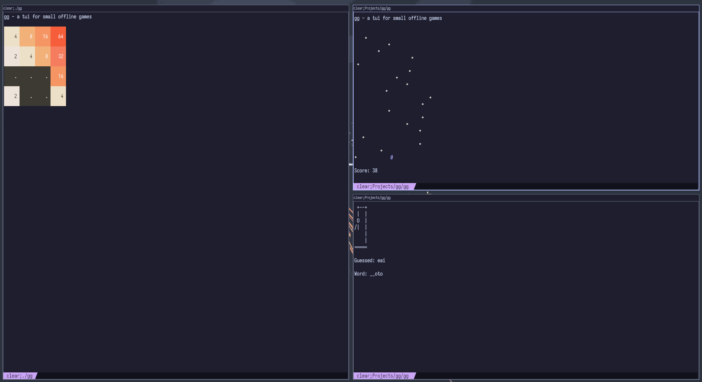

<div align="center">
<h2 align="center">gg</h2>
<p align="center">
games you can play in your terminal!

<br/>
<br/>

<a href="https://github.com/Kaamkiya/gg/issues/new">Report a bug or request a feature</a>

</p>
</div>

[](https://unlicense.org)
[](https://github.com/Kaamkiya/gg/commits)
[](https://github.com/Kaamkiya/gg/issues)
[](https://github.com/Kaamkiya/gg/pulls)
[](https://github.com/Kaamkiya/gg/releases)
[](https://goreportcard.com/report/github.com/Kaamkiya/gg)


## About The Project



I like to play video games, probably like you. But I prefer smaller, more minimal games. And I figured the best way to keep games minimal is to play them from the CLI!

And as a developer, that's perfect because half of my computer time is spent in a terminal.

Enjoy playing terminal games :)

### Built With

- [Go](https://go.dev)
- [Charm libraries](https://charm.sh)

## Getting Started

This section is about installation and usage.

### Prerequisites

- Go (optional)

### Installation

1. Installation with Go:
  ```
  go install github.com/Kaamkiya/gg@latest
  ```
2. Running with Go: if you don't want to install it but still want to play
  ```
  go run github.com/Kaamkiya/gg@latest
  ```
3. Release binary:
  * Go to the [releases page](https://github.com/Kaamkiya/gg/releases)
  * Download the one for your platform
  * Make it executable (`chmod +x ./<file>`)
  * Run it!

## Usage

Enter the command into the terminal:

```
gg
```

Then select a game and enjoy!

## Contributing

All sorts of contributions are welcome!

To contribute:

1. Fork the Project
2. Create your Feature Branch (`git checkout -b feature/AmazingFeature`)
3. Commit your Changes (`git commit -m 'Add some AmazingFeature'`)
4. Push to the Branch (`git push origin feature/AmazingFeature`)
5. Open a Pull Request

## License

Distributed under the Unlicense. See [Unlicense License](https://unlicense.org) for more information.

## Acknowledgments


- [Al Sweigart's list of games to clone](https://inventwithpython.com/blog/2012/02/20/i-need-practice-programming-49-ideas-for-game-clones-to-code/)

